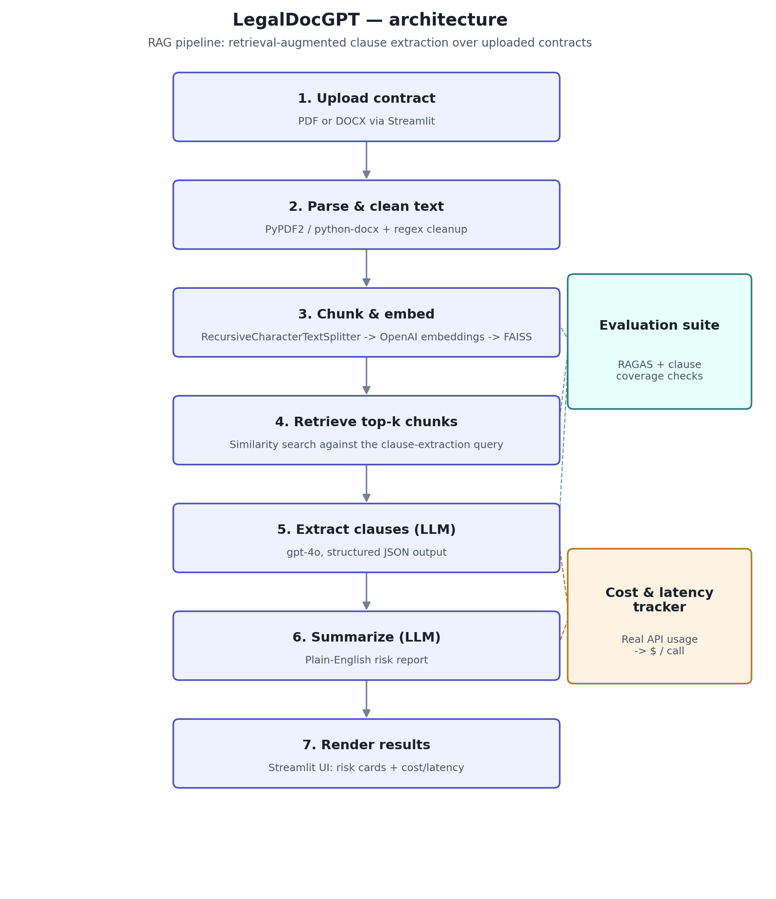

# ⚖️ LegalDoc GPT — AI-Powered Contract Analysis

An AI-powered contract analysis tool that uses a **Retrieval-Augmented Generation (RAG)** pipeline to extract key clauses, assess risk levels, and generate plain-English summaries from legal documents — built for non-lawyers who need to understand contracts quickly.

[](tests/)
[](LICENSE)
[](requirements.txt)

---

## 🏗️ Architecture



Contracts are chunked and embedded rather than sent to the LLM whole, so the
pipeline scales to long documents and grounds every extracted clause in
retrieved source text instead of the model's unsupported recall. Retrieval
and cost/latency are both measured, not assumed — see **Evaluation** and
**Cost & Latency** below.

> **Note on the image above:** this is an architecture diagram, not a UI
> screenshot. A live product screenshot will be added here once the app is
> deployed (see Deployment below) — I'd rather show you the real pipeline
> than a placeholder mockup.

---

## ✨ Features

- **RAG-based clause extraction** — contracts are chunked and embedded so large documents don't overflow the context window
- **Structured risk scoring** — each clause is tagged as High / Medium / Low risk with a plain-English explanation
- **Plain-English summary** — non-lawyers can understand what they're signing
- **Streamlit UI** — clean browser-based interface with risk overview metrics, a live model selector, and a cost/latency breakdown per run
- **Download report** — export the full analysis as a JSON file
- **Supports PDF and DOCX** — handles both common contract formats
- **Evaluated, not just demoed** — a RAGAS-based eval suite scores faithfulness, answer relevancy, context precision, and context recall against a hand-labeled test set, plus a free deterministic clause-coverage check
- **Cost-aware** — every LLM call is tracked with real API token usage and priced against current per-model rates, surfaced in both the CLI and the UI

---

## 🗂️ Project Structure

```
LegalDocGPT/
│
├── app/
│   ├── contract_parser.py      # PDF/DOCX text extraction
│   ├── clause_analyzer.py      # RAG pipeline: chunk, embed, retrieve, extract
│   └── summarizer.py           # Plain-English report generation
│
├── utils/
│   ├── logger.py               # Logging utility
│   ├── text_cleaner.py         # Text preprocessing
│   └── cost_tracker.py         # Real token usage -> cost & latency per stage
│
├── eval/
│   ├── test_contracts/         # 3 synthetic contracts used as eval fixtures
│   ├── eval_dataset.json       # Ground-truth Q&A pairs for RAGAS
│   ├── run_ragas_eval.py       # RAGAS eval + deterministic clause coverage check
│   └── results/                # Eval output (generated when you run the script)
│
├── tests/                      # pytest suite — runs offline, no API key needed
│   ├── test_text_cleaner.py
│   ├── test_contract_parser.py
│   ├── test_clause_analyzer.py
│   ├── test_cost_tracker.py
│   └── test_eval_script.py
│
├── assets/
│   └── architecture_diagram.png
│
├── streamlit_app.py            # Streamlit web UI
├── main.py                     # CLI entry point
├── requirements.txt            # Pinned, tested versions
├── requirements-dev.txt        # + pytest, ragas, for eval/testing
├── LICENSE
└── README.md
```

---

## 🚀 Getting Started

### 1. Clone the repository
```bash
git clone https://github.com/dramya937/LegalDocGPT.git
cd LegalDocGPT
```

### 2. Install dependencies
```bash
pip install -r requirements.txt
```

### 3. Set your OpenAI API key

You can set it via the Streamlit sidebar at runtime, or export it as an environment variable:

```bash
export OPENAI_API_KEY=your_api_key_here
```

### 4. Run the Streamlit app
```bash
streamlit run streamlit_app.py
```

### 5. Or use the CLI
```bash
python main.py
```

---

## 🧪 Testing

The test suite is fully offline — no OpenAI API key required. It covers text
cleaning, document parsing, the LLM JSON-parsing fallback path (including
malformed output), cost/latency math, and eval-fixture consistency.

```bash
pip install -r requirements-dev.txt
pytest tests/ -v
```

15 of 17 tests pass without network access; the remaining 2 need one-time
internet access for `tiktoken` to download its encoding file (this happens
automatically the first time you run anything that counts tokens, and is
cached after that).

---

## 📏 Evaluation

Shipping a RAG pipeline without measuring it is shipping a guess. `eval/`
contains two complementary checks:

**1. RAGAS metrics** (LLM-judged, needs an API key — costs about $0.10–0.50 to run):
- **Faithfulness** — does the generated answer stay grounded in what was actually retrieved, or does it hallucinate beyond the source text?
- **Answer relevancy** — does the answer actually address the question asked?
- **Context precision** — are the retrieved chunks relevant, or is the retriever pulling noise?
- **Context recall** — did retrieval surface what the ground-truth answer actually needs?

**2. Clause coverage** (free, deterministic, no LLM judge):
Runs the real `analyze_clauses()` pipeline against 3 synthetic test
contracts with known clause types (payment terms, termination, liability,
confidentiality, indemnification, etc.) and checks whether each one got
surfaced. Cheap enough to run on every change.

```bash
export OPENAI_API_KEY=your_api_key_here
python eval/run_ragas_eval.py
```

Results are written to `eval/results/` (`ragas_scores.json`,
`clause_coverage.json`, `run_cost_summary.json`) along with the realized
dollar cost of the eval run itself.

> **Known upstream issue:** as of `ragas` 0.2.10–0.4.3, the package
> unconditionally imports `ChatVertexAI` from a `langchain-community` module
> path that no longer exists (Vertex AI integration moved to its own
> package). Since this project never uses Vertex AI, `run_ragas_eval.py`
> stubs the dead import rather than downgrading the whole LangChain stack —
> see the comment at the top of the script if you're curious why.

---

## 💵 Cost & Latency

Every LLM call is tracked in `utils/cost_tracker.py`, which reads **real**
token counts from the OpenAI API response (not an estimate) and prices them
against current per-model rates:

| Model | Input ($/1M tokens) | Output ($/1M tokens) |
|---|---|---|
| gpt-4 (legacy) | $30.00 | $60.00 |
| **gpt-4o** (default) | $2.50 | $10.00 |
| gpt-4o-mini | $0.15 | $0.60 |
| gpt-4.1 | $2.00 | $8.00 |
| gpt-4.1-mini | $0.40 | $1.60 |

*(Rates as of Aug 2026 — check [openai.com/api/pricing](https://openai.com/api/pricing/) periodically, since these have dropped substantially more than once.)*

The Streamlit sidebar lets you switch models per run and see the resulting
cost/latency tradeoff directly — a several-page contract typically costs a
fraction of a cent to a few cents on gpt-4o, and roughly 10x that on legacy
gpt-4.

---

## 🛠️ Tech Stack

| Component | Technology |
|---|---|
| Language | Python 3.10+ |
| LLM | gpt-4o (default, configurable) |
| RAG Framework | LangChain 1.x |
| Vector Store | FAISS |
| Embeddings | OpenAI Embeddings |
| UI | Streamlit |
| Document Parsing | PyPDF2, python-docx |
| Evaluation | RAGAS |
| Testing | pytest |

---

## 💡 Why RAG Instead of Direct GPT?

Standard contract analysis tools send the entire document to GPT in one call. This breaks on large contracts (50+ pages) due to context window limits and produces lower quality results with no source grounding.

This tool uses RAG to:
- Split contracts into overlapping chunks (1000 tokens, 150 overlap)
- Embed and store chunks in a FAISS vector store
- Retrieve only the most relevant sections per query
- Ground the LLM's responses in actual contract text — and measure that grounding with the faithfulness metric above, rather than assuming it

---

## ☁️ Deployment

This app is designed to deploy to **Streamlit Community Cloud** in a few minutes:

1. Push this repo to your own GitHub account
2. Go to [share.streamlit.io](https://share.streamlit.io) and connect the repo
3. Set the main file path to `streamlit_app.py`
4. Add `OPENAI_API_KEY` as a secret in the app settings (Settings → Secrets)
5. Deploy — no server config needed since `requirements.txt` is already pinned to tested versions

---

## 📌 Future Improvements

- [ ] Multi-contract comparison
- [ ] Clause-level highlighting in original document
- [ ] Support for scanned PDFs via OCR (Tesseract)
- [ ] Fine-tuned model on legal datasets
- [ ] Live deployed demo link + real UI screenshot

---

## 📄 License

[MIT License](LICENSE)
